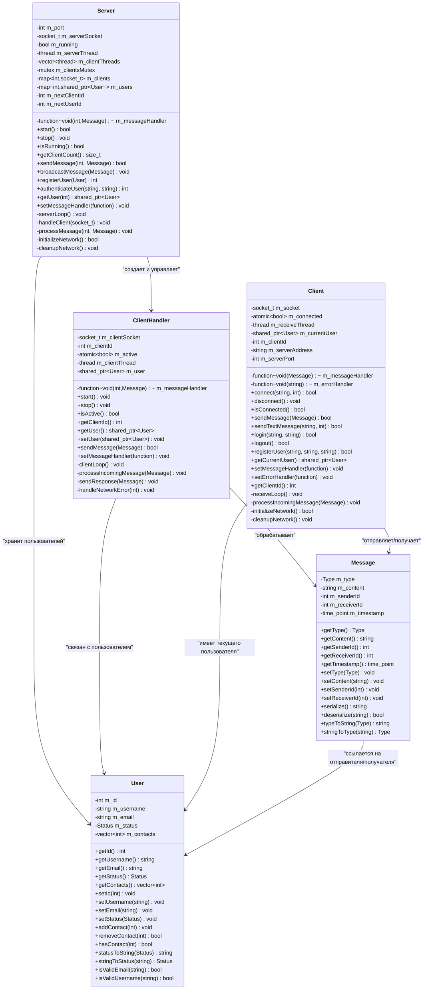
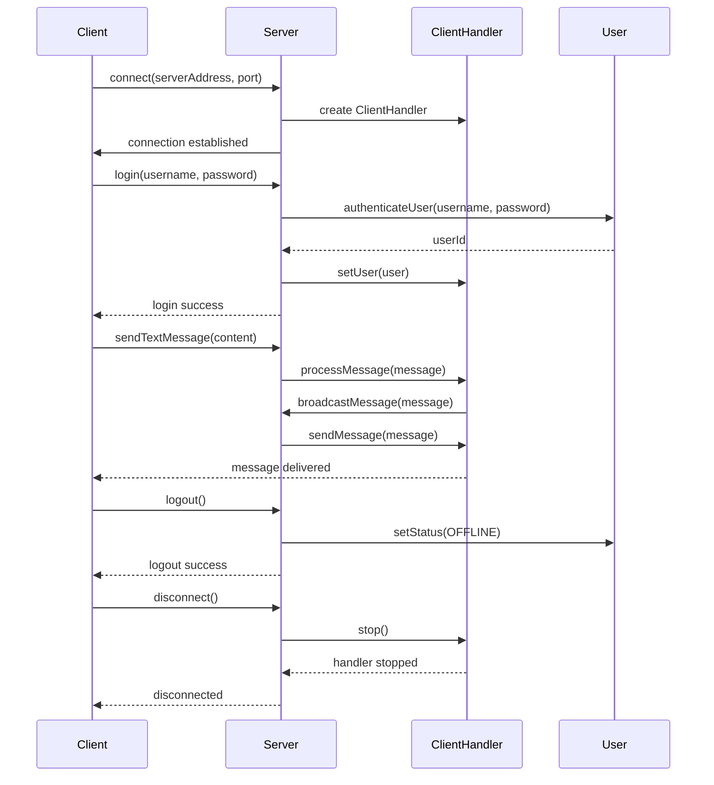
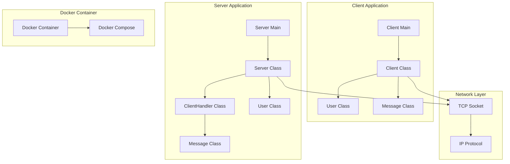
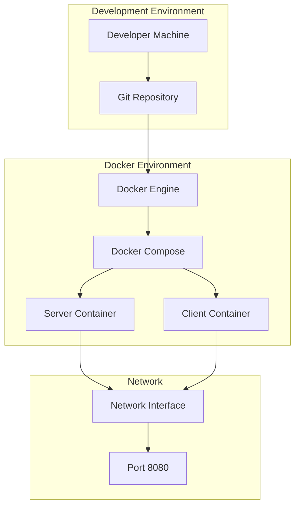

# Диаграмма классов клиент-серверного приложения

## Общая архитектура

## Диаграмма взаимодействия (Sequence Diagram)

## Диаграмма компонентов

## Диаграмма развертывания

## Описание классов

### Message
Класс для представления сообщений в системе. Поддерживает различные типы сообщений (LOGIN, LOGOUT, TEXT, FILE, STATUS, ERROR) и обеспечивает сериализацию/десериализацию для передачи по сети.

### User
Класс для представления пользователей системы. Содержит информацию о пользователе, его статусе и списке контактов. Включает методы валидации данных.

### Server
Основной класс сервера, реализующий многопоточную обработку клиентских подключений. Управляет пользователями, обрабатывает сообщения и обеспечивает связь между клиентами.

### ClientHandler
Класс для обработки отдельного клиентского подключения. Работает в отдельном потоке и обрабатывает входящие сообщения от конкретного клиента.

### Client
Класс клиентского приложения, обеспечивающий подключение к серверу, аутентификацию и обмен сообщениями. Работает в многопоточном режиме для приема сообщений.
