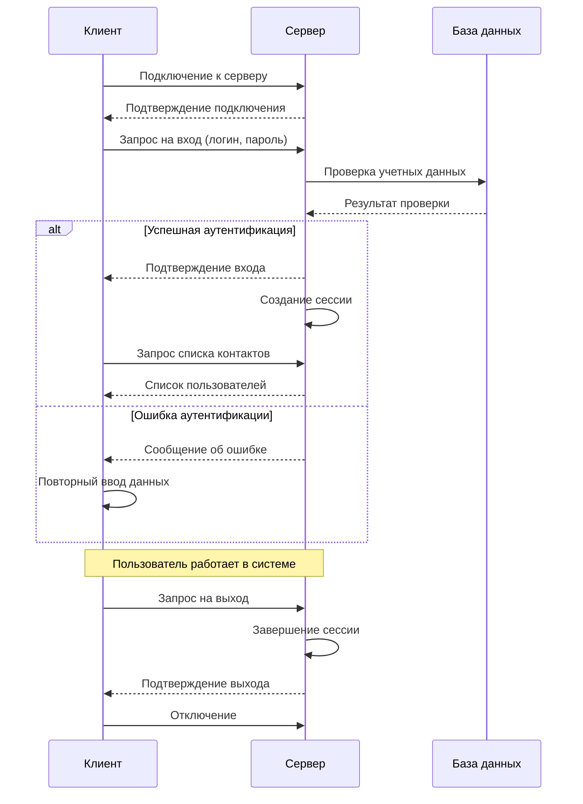
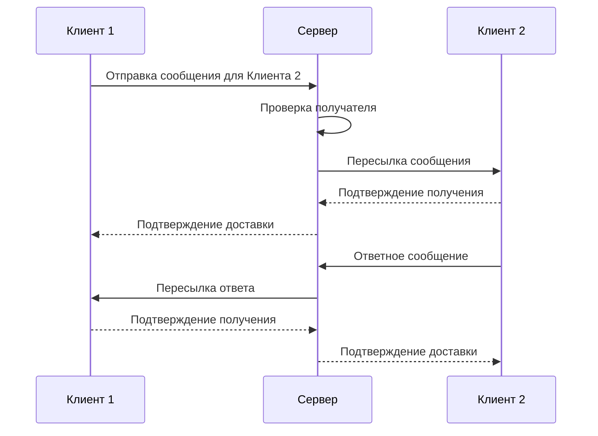

# Диаграмма Use Case для клиент-серверного приложения

## Описание

Use-case представляет из себя описание, которое показывает взаимодействие пользователей между собой. Например - пользователя и системы.

1. Название сценария
2. Цель сценария (что должно выполняться)
3. Пользователи (кто с кем взаимодействует: пользователь - система, система - система)
4. Условия при которых выполняется сценарий
5. Если есть, то расписать альтернативные пути сценария

## Диаграмма Use Case

```mermaid
graph TB
    %% Акторы
    Client[👤 Клиент]
    Server[🖥️ Сервер]
    Admin[👨‍💼 Администратор]
    System[⚙️ Система]

    %% Use Cases - Аутентификация
    Register[📝 Регистрация]
    Login[🔐 Вход в систему]
    Logout[🚪 Выход из системы]

    %% Use Cases - Клиентские функции
    Connect[🔗 Подключение к серверу]
    SendMessage[💬 Отправка сообщения]
    ReceiveMessage[📨 Получение сообщения]
    ViewContacts[👥 Просмотр контактов]
    UpdateStatus[📊 Обновление статуса]

    %% Use Cases - Серверные функции
    HandleConnection[🔧 Обработка подключения]
    RouteMessage[📤 Маршрутизация сообщений]
    ManageUsers[👥 Управление пользователями]
    BroadcastMessage[📢 Рассылка сообщений]

    %% Use Cases - Административные функции
    ViewLogs[📋 Просмотр логов]
    MonitorConnections[📊 Мониторинг подключений]
    ManageServer[⚙️ Управление сервером]

    %% Связи акторов с Use Cases
    Client --> Connect
    Client --> Register
    Client --> Login
    Client --> Logout
    Client --> SendMessage
    Client --> ReceiveMessage
    Client --> ViewContacts
    Client --> UpdateStatus

    Server --> HandleConnection
    Server --> RouteMessage
    Server --> ManageUsers
    Server --> BroadcastMessage

    Admin --> ViewLogs
    Admin --> MonitorConnections
    Admin --> ManageServer
    Admin --> Login
    Admin --> Logout

    System --> HandleConnection
    System --> RouteMessage

    %% Связи между Use Cases
    Register --> Login
    Login --> Logout
    Logout --> Login
    Connect --> HandleConnection
    SendMessage --> RouteMessage
    RouteMessage --> BroadcastMessage
    RouteMessage --> ReceiveMessage
    ManageUsers --> ViewContacts
```

## Процесс авторизации

Как пользователь клиент-серверного приложения, я хочу авторизоваться, чтобы подключиться к серверу и обмениваться сообщениями с другими пользователями.

---

**Название:** Авторизация и обмен сообщениями в клиент-серверном приложении

**Действующие лица:** пользователи клиент-серверного приложения

* инициатор обращения на сервер - клиент
* сервер
* администратор системы

**Предварительные условия:**

* инициатор обращения имеет установленное клиентское приложение;
* инициатор обращения имеет зарегистрированную учетную запись для работы с сервером;
* сервер запущен и готов к приему подключений;
* оба подключены к сети;

**Успешный сценарий:**

* инициатор обращения запускает клиентское приложение;
* инициатор обращения подключается к серверу;
* инициатор обращения успешно авторизируется (вводит логин и пароль);
* сервер идентифицирует пользователя и дает доступ к системе;
* инициатор обращения может отправлять и получать сообщения;
* инициатор обращения может просматривать список контактов;
* инициатор обращения может обновлять свой статус;
* сервер успешно маршрутизирует все сообщения;
* инициатор обращения отключается от сервера;

**Альтернативные сценарии:**

* Инициатор обращения не может подключиться к серверу:
  * Проверить наличие сетевого подключения;
  * Проверить правильность адреса сервера и порта;
  * Убедиться, что сервер запущен;
  * Попробовать подключиться позже;

* Инициатор обращения не может авторизоваться на сервере:
  * Проверить правильность введенных логина и пароля;
  * Попробовать ввести данные еще раз;
  * Создать новую учетную запись, если её не существует;
  * Обратиться к администратору для восстановления доступа;

* Сервер не доставляет сообщения:
  * Со стороны клиента:
    * Проверить стабильность сетевого подключения;
    * Попробовать переподключиться к серверу;
    * Проверить, что получатель находится в сети;
  * Со стороны сервера (разработчиков):
    * Проверить логи сервера на наличие ошибок;
    * Убедиться, что сервер не перегружен;
    * Проверить корректность маршрутизации сообщений;
    * Перезапустить сервер при необходимости;

* Клиент не может отправить сообщение:
  * Проверить, что клиент авторизован;
  * Убедиться, что сообщение не пустое;
  * Проверить ограничения на размер сообщения;
  * Попробовать отправить сообщение позже;

## Детальное описание Use Cases

### 1. Аутентификация и управление сессией

#### 1.1 Регистрация
- **Актор:** Клиент
- **Описание:** Создание новой учетной записи в системе
- **Предусловия:** Клиент не зарегистрирован в системе
- **Основной поток:**
  1. Клиент выбирает опцию "Регистрация"
  2. Вводит имя пользователя, email и пароль
  3. Система проверяет уникальность данных
  4. Создается новая учетная запись
  5. Клиент получает подтверждение регистрации

#### 1.2 Вход в систему
- **Актор:** Клиент, Администратор
- **Описание:** Аутентификация пользователя в системе
- **Предусловия:** Пользователь зарегистрирован в системе
- **Основной поток:**
  1. Пользователь вводит логин и пароль
  2. Система проверяет учетные данные
  3. При успешной проверке создается сессия
  4. Пользователь получает доступ к системе

#### 1.3 Выход из системы
- **Актор:** Клиент, Администратор
- **Описание:** Завершение сессии пользователя
- **Предусловия:** Пользователь авторизован в системе
- **Основной поток:**
  1. Пользователь выбирает опцию "Выход"
  2. Система завершает сессию
  3. Пользователь отключается от сервера

### 2. Клиентские функции

#### 2.1 Подключение к серверу
- **Актор:** Клиент
- **Описание:** Установление соединения с сервером
- **Предусловия:** Сервер запущен и доступен
- **Основной поток:**
  1. Клиент указывает адрес сервера и порт
  2. Устанавливается TCP соединение
  3. Сервер подтверждает подключение
  4. Клиент готов к обмену сообщениями

#### 2.2 Отправка сообщения
- **Актор:** Клиент
- **Описание:** Отправка текстового сообщения другому пользователю
- **Предусловия:** Клиент подключен и авторизован
- **Основной поток:**
  1. Клиент выбирает получателя
  2. Вводит текст сообщения
  3. Отправляет сообщение на сервер
  4. Сервер подтверждает получение

#### 2.3 Получение сообщения
- **Актор:** Клиент
- **Описание:** Получение входящих сообщений
- **Предусловия:** Клиент подключен и авторизован
- **Основной поток:**
  1. Сервер отправляет сообщение клиенту
  2. Клиент получает и отображает сообщение
  3. Клиент может ответить на сообщение

#### 2.4 Просмотр контактов
- **Актор:** Клиент
- **Описание:** Просмотр списка доступных контактов
- **Предусловия:** Клиент авторизован
- **Основной поток:**
  1. Клиент запрашивает список контактов
  2. Сервер возвращает список пользователей
  3. Клиент просматривает доступные контакты

#### 2.5 Обновление статуса
- **Актор:** Клиент
- **Описание:** Изменение статуса пользователя (онлайн, отошел, занят)
- **Предусловия:** Клиент авторизован
- **Основной поток:**
  1. Клиент выбирает новый статус
  2. Отправляет обновление на сервер
  3. Сервер обновляет статус пользователя
  4. Другие пользователи видят новый статус

### 3. Серверные функции

#### 3.1 Обработка подключения
- **Актор:** Сервер
- **Описание:** Принятие и обработка новых клиентских подключений
- **Предусловия:** Сервер запущен и слушает порт
- **Основной поток:**
  1. Сервер принимает новое подключение
  2. Создает новый поток для обработки клиента
  3. Добавляет клиента в список активных подключений
  4. Начинает обработку сообщений от клиента

#### 3.2 Маршрутизация сообщений
- **Актор:** Сервер
- **Описание:** Пересылка сообщений между клиентами
- **Предусловия:** Сообщение получено от авторизованного клиента
- **Основной поток:**
  1. Сервер получает сообщение от клиента
  2. Определяет получателя сообщения
  3. Проверяет, что получатель онлайн
  4. Пересылает сообщение получателю

#### 3.3 Управление пользователями
- **Актор:** Сервер
- **Описание:** Управление данными пользователей и их сессиями
- **Предусловия:** Сервер запущен
- **Основной поток:**
  1. Сервер хранит информацию о пользователях
  2. Отслеживает активные сессии
  3. Обновляет статусы пользователей
  4. Удаляет неактивные сессии

#### 3.4 Рассылка сообщений
- **Актор:** Сервер
- **Описание:** Отправка сообщений всем подключенным клиентам
- **Предусловия:** Есть активные подключения
- **Основной поток:**
  1. Сервер получает запрос на рассылку
  2. Определяет список активных клиентов
  3. Отправляет сообщение всем клиентам
  4. Подтверждает доставку

### 4. Административные функции

#### 4.1 Просмотр логов
- **Актор:** Администратор
- **Описание:** Просмотр логов сервера для диагностики
- **Предусловия:** Администратор авторизован
- **Основной поток:**
  1. Администратор запрашивает логи
  2. Сервер предоставляет доступ к логам
  3. Администратор анализирует информацию

#### 4.2 Мониторинг подключений
- **Актор:** Администратор
- **Описание:** Отслеживание активных подключений к серверу
- **Предусловия:** Администратор авторизован
- **Основной поток:**
  1. Администратор запрашивает статистику
  2. Сервер предоставляет информацию о подключениях
  3. Администратор анализирует нагрузку

#### 4.3 Управление сервером
- **Актор:** Администратор
- **Описание:** Управление настройками и состоянием сервера
- **Предусловия:** Администратор авторизован
- **Основной поток:**
  1. Администратор изменяет настройки сервера
  2. Сервер применяет изменения
  3. Администратор проверяет результат

## Диаграмма последовательности для процесса авторизации

## Диаграмма последовательности для обмена сообщениями

## Заключение

Данная диаграмма Use Case описывает все основные взаимодействия в клиент-серверном приложении, включая процессы аутентификации, обмена сообщениями и административного управления. Диаграмма помогает понять функциональность системы и может служить основой для дальнейшей разработки и тестирования.
